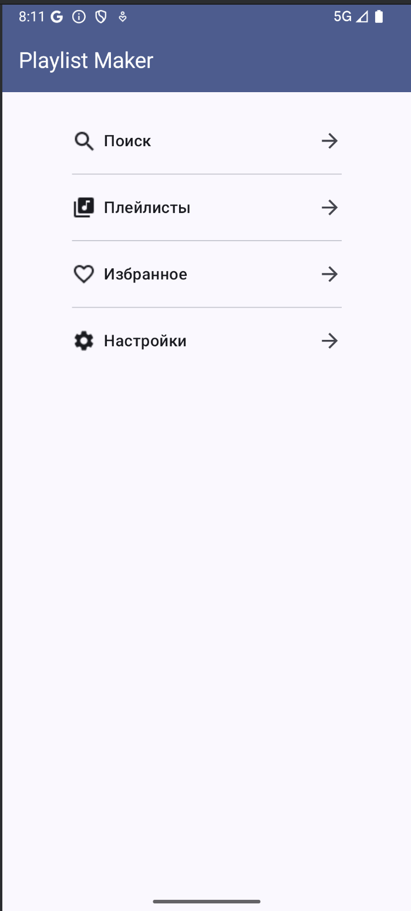
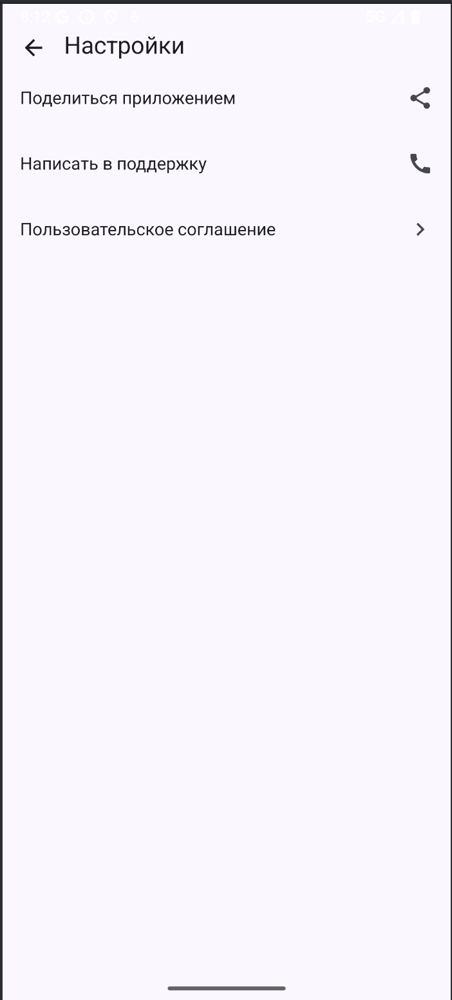
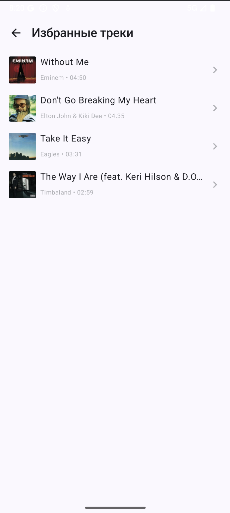
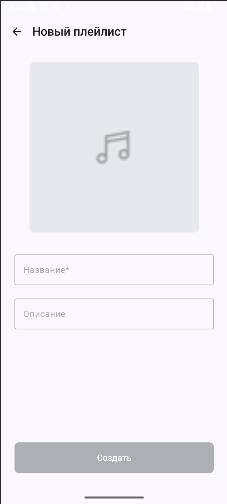
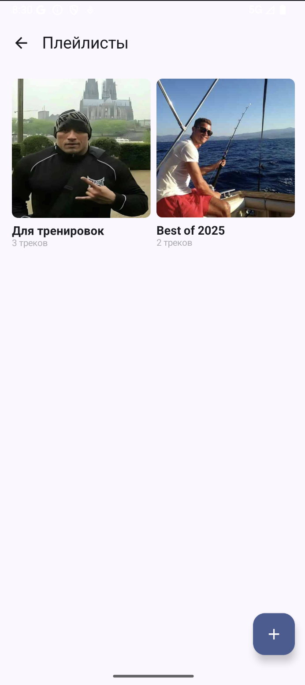
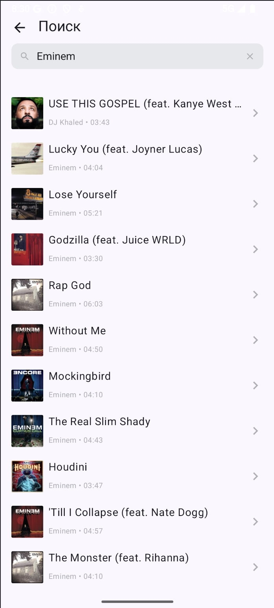
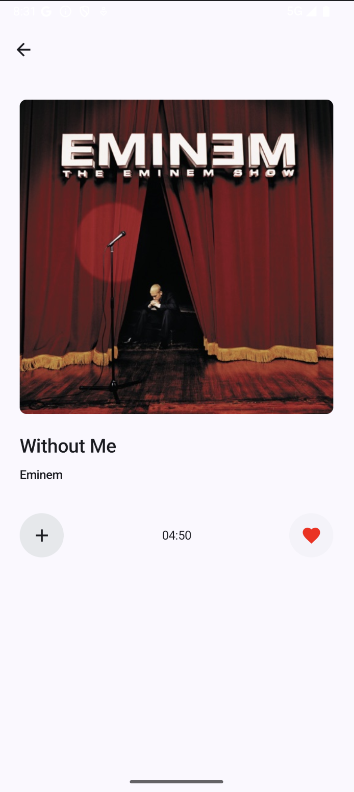

# Проект Playlist Maker
Мобильное приложение для поиска, хранения и прослушивания музыкальных треков с удобной работой с плейлистами. Создан в рамках курса Android‑разработчик (Яндекс Практикум). UI полностью на Jetpack Compose, архитектура — Clean Architecture + MVVM c StateFlow.

## Возможности приложения
- Поиск треков с отображением истории запросов и состояния загрузки.
- Предпрослушивание и детальный экран трека с управлением воспроизведением.
- Добавление треков в избранное и управление списком.
- Создание плейлистов: обложка, название, описание, добавление/удаление треков, шаринг.
- Настройки: переключение темы, ссылки на поддержку, шаринг приложения, пользовательское соглашение.
- Навигация по нижней панели с сохранением состояния экранов.

## Общая информация
- Стек: Kotlin, Jetpack Compose, Navigation, MVVM, StateFlow, Coroutines.
- Архитектура: три слоя (data/domain/presentation), Single Activity.
- Статус: версия v8.0; реализованы поиск, плейлисты, избранное, настройки.
- Запуск: открыть проект в Android Studio, дождаться синхронизации Gradle и запустить на эмуляторе/устройстве.

## Главный экран
- Точки входа в поиск, плейлисты, избранное и настройки.
- Карточки/плитки ведут на соответствующие разделы приложения.

## Вкладка настройки
- Переключатель темы (светлая/темная).
- Быстрый шаринг приложения, письмо в поддержку, переход к пользовательскому соглашению.

## Вкладка избранное
- Список сохраненных треков; быстрый переход к плееру/деталям.
- Синхронизация с плейлистами: треки из плеера можно добавлять и сюда.

## Вкладка плей-лист
- Экран создания плейлиста: выбор обложки, названия и описания.
- Экран плейлиста: список треков, счетчик длительности, шаринг плейлиста, удаление треков.

## Вкладка поиск
- Экран поиска: строка ввода, история, состояния загрузки/ошибок, результаты в виде списка треков.
- Экран деталей трека: обложка, таймлайны, управление воспроизведением, добавление в избранное или плейлист.

